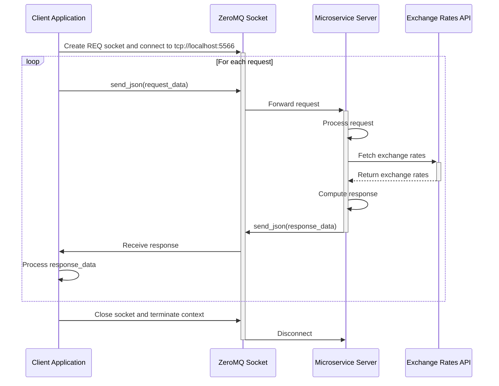

# Item Currency Cost Microservice

## Dependencies and Requirements

- **ZeroMQ Library**: Install using `pip install pyzmq`.
- **Requests Library**: The microservice uses `requests` to fetch exchange rates, install using `pip install requests`.

## Microservice Connection Details

- **Protocol**: TCP
- **Host**: localhost (or the IP address where the microservice is running)
- **Port**: 5566

## How to Interact with the Microservice

### Step 1: Setup ZeroMQ Context & Socket

Begin by importing necessary modules and setting up the ZeroMQ context and socket.

```python
import zmq

# Create a ZeroMQ context
context = zmq.Context()

# Create a REQ (Request) socket
socket = context.socket(zmq.REQ)

# Connect to the microservice
socket.connect("tcp://localhost:5566")
```

### Step 2: Prepare Your Request Data

Construct JSON-formatted dictionary with the required parameters for the action you wish to perform.

Example for `currency_per_unit`:

```python
request_data = {
    "action": "currency_per_unit",
    "currency": "CAD",
    "cost": 100.00,     # Cost in USD
    "units": 5          # Number of units
}
```

### Step 3: Programmatically REQUESTING Data

Send the request to the microservice using `socket.send_json()`.

```python
socket.send_json(request_data)
print(f"Sent request: {request_data}")
```

### Step 4: Programmatically RECEIVING Data

Receive the response from the microservice using `socket.recv_json()`.

```python
response_data = socket.recv_json()
print(f"Received response: {response_data}")
```

## UML Sequence Diagram


